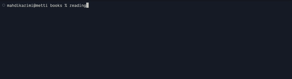

# reading-planner



## Getting started

Make sure you have `node` and `npm` installed.

```
npm i -g reading-planner
```

```
reading-planner my-book.epub
```
## Why this exists?

This app lets me break down epub books I read on the regular into manageable pieces, in a `events.ics` file. I then import the events file in my main calendar so I always find time to read and actually finish the books I'm reading.